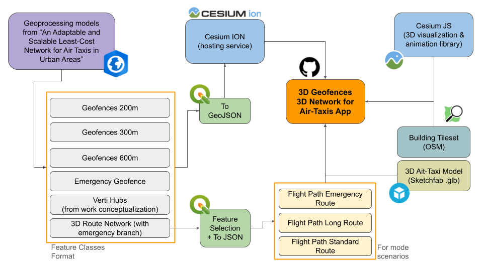

# 🛰 Cesium Certified Developer Project: Visualization of 3D Geofences and a 3D Network for Air-Taxis in New York city.

## 📑 Table of Contents

1. [About the Project](#-about-the-project)
2. [Data inputs and preliminary requirements](#-data-inputs-and-preliminary-requirements)
3. [Workflow Diagram](#-workflow-diagram)
4. [Design](#-design)
5. [Codebase](#-codebase)
6. [Demo](#-demo)
7. [Live Demo](#-live-demo)
8. [Future Work](#-future-work)
9. [Acknowledgments](#-acknowledgments)

## 📘 About the Project
**Project Objective:** 

This project aims to **realistically visualize the main three-dimensional components** derived from the research [*“An Adaptable and Scalable Least-Cost Network for Air Taxis in Urban Areas.”*](https://www.researchgate.net/publication/341173954_An_adaptable_and_scalable_least-cost_network_for_air-taxis_in_urban_areas_Study_area_Manhattan_New_York)  
Through the implementation of Cesium JS, the project provides a suitable environment to explore potential 3D routes for air taxis, Vertihubs, and Flight Restrictions based on real and existing regulations recommended by agencies, authorities, and designers of electric sandcraft of the eVTOL (Electrical Vertical Take-Off and Landing) type.

**Specific Objectives:**

1. Visualize 3D geofences according to restriction orders, allowing different layers to be turned on and off in the geographic viewer.
2. Visualize the 3D route network for air taxis.
3. Allow the user to compare the different existing buildings with the estimated 3D geofences and 3D route network.
4. Visualize the route of an air taxi passing through different hubs along its way and following the generated 3D route.
5. Visualize a short air taxi route between some hubs (pre-emergency or normal situation).
6. Visualize the alternate route visualized in Objective 5 when a geofence exists due to an emergency (emergency situation).

**A little context:**
Back in 2019, my friend and colleague Moritz Hildemann and I developed a project for the GIS Applications subject at the Master's Degree in Geospatial Technologies, a project that addresses the challenge of designing air taxi routes in urban environments that are safe, efficient, and minimally disruptive to citizens, while respecting legal and practical constraints in three-dimensional urban airspace.

To better understand 3D geofences, they were grouped according to the POIs considered in the paper:

#### 🏗️ Vertical and Horizontal Restrictions

| Landuse             | Vertical (m) | Horizontal (m) |
|---------------------|--------------|----------------|
| Airport             | 600          | Dynamic        |
| Hospitals           | 300          | 300            |
| Universities        | 200          | 300            |
| Embassies           | 300          | 300            |
| Parks               | 300          | 100            |
| Graveyards          | 300          | 100            |
| Recreational areas  | 300          | 100            |
| Rooftops            | 152.4        | -              |

*Table 1. Vertical and horizontal restrictions in meters.*

Geofences Scheme:

  

## 🧩 Data inputs and preliminary requirements
Before starting the development of this specific project, the following datasets, software, and libraries were required. Please note that most of the data used as inputs in this project were outputs obtained from the aforementioned paper published at the AGILE 2019 conference.

### 📂 Data Requirements

 - **Geofences (Low Restriction – 200 m)** — provided in GeoJSON format  
 - **Geofences (Medium Restriction – 300 m)** — provided in GeoJSON format  
 - **Geofences (High Restriction – 600 m)** — provided in GeoJSON format  
 - **Emergency Geofences** — GeoJSON format  
 - **Vertihubs** — GeoJSON format  
 - **3D Route Network (New York area)** — GeoJSON format  
 - **Flight Path (Long Route)** — JSON format  
   - Represents an extended path passing through multiple vertihubs, used for flight animation.  
 - **Flight Path (Standard Route)** — JSON format  
   - Connects two vertihubs under normal conditions.  
 - **Flight Path (Alternate Route with Emergency Geofence)** — JSON format  
   - Simulates rerouting behavior when an emergency geofence is active.  
 - **Building Tileset** — imported from **OSM Buildings**
 - **VTOL 3D Air-Taxi Model** - downloaded from Sketchfab (CC Attribution 4.0 International)
 
 ### 🧰 Software & Libraries
 
 - **CesiumJS** — for 3D visualization and flight animation  
 - **Cesium ION** — for asset hosting and terrain data integration  
 - **Visual Studio Code** — development environment for Cesium scripts  
 - **QGIS / ArcGIS Pro** — for GIS data preparation, processing, and export  

## 🔁 Workflow Diagram
Below is a general scheme used when developing the app:

  

## 🖌️Design
Proposed design and functionality

  

## 💻 Codebase

The project is composed of two main files:

- [`index.html`](./index.html) — The main entry point of the application.  
  It initializes the Cesium viewer, loads styles and scripts, and defines the structure for the 3D visualization.

- [`geofence_proj.js`](./geofence_proj.js) — Contains the core logic of the project.  
  It loads and renders GeoJSON data (geofences, vertiports, and flight paths), handles dynamic visual updates, and controls Cesium’s entity behavior during animations.

Both files work together to visualize air-taxi networks and their operational constraints in a realistic 3D environment using **CesiumJS** and **Cesium ION**.

## 🎥 Demo

Below are four short Loom videos demonstrating the main functionalities and visualization stages of the project.

1. **Initial 3D Geofences + 3D Route Network Visualization**  
   Demonstrates the integration of geofences at multiple restriction levels and the rendering of the 3D air-taxi route network across Manhattan.  
   ▶️ [Watch on Loom](https://www.loom.com/share/569f5f7288ee4d4896ce623eab672c30?sid=42cebd43-2946-4e0c-b638-1955be70137f)

2. **Air-Taxi Flight Tracking – Long Route (Multiple Hubs)**  
   Shows a full air-taxi trajectory passing through several vertiports using the least-cost network approach.  
   ▶️ [Watch on Loom](https://www.loom.com/share/ee13b494bfa94415980ea3454596680d?sid=372e3097-22ec-4b43-92bb-749f693b27d3)

3. **Air-Taxi Flight Tracking – Short Route (Pre-Emergency Scenario)**  
   Displays a normal short flight path between two hubs before any emergency restriction is triggered.  
   ▶️ [Watch on Loom](https://www.loom.com/share/0513b317abbe4fcf96ce6623691ab042?sid=a6b548e5-207b-462f-a5d1-2f4b3c438bd0)

4. **Air-Taxi Flight Tracking – Short Route with Emergency Geofence**  
   Illustrates how an emergency geofence activates dynamically, forcing the system to recalculate and visualize an alternate flight path from one shown in the pre-emergency.
   ▶️ [Watch on Loom](https://www.loom.com/share/6fe41700c8c746cdadc54ba22ec10a5b?sid=3f37bd66-b039-47b6-9be3-7c77f6dad1b0)

## 🌐 Live Demo

Access the published application here:  
👉 [**Launch the Air-Taxi 3D Visualization App**](https://carlosjdelgadonovaims.github.io/3d_network_geofence_cesium_visualization/)

## 🚀 Future Work

Many improvements can be proposed for this project, which I thoroughly enjoyed developing while integrating knowledge from **Cesium tutorials** and the **Cesium Community Forum**.  
Below are some ideas for future enhancements and extensions that could further strengthen this work:

- **Automated Geoprocessing Service**  
  Develop a service that automatically executes geoprocessing models and exports outputs in formats that can be seamlessly uploaded to **Cesium ION**.  
  This would enable **dynamic generation of 3D routes and geofences** directly from external data sources.

- **Optional Auto-Tracking for Air-Taxi Animations**  
  In this version, the air-taxi trajectory was intentionally not auto-tracked to allow users to freely explore the 3D scene.  
  A future improvement could include a **toggle button** that enables or disables **automatic camera tracking** of the air-taxi’s movement.

- **3D Tiles for Geofences**  
  Explore the possibility of generating **3D Tilesets** for geofences instead of GeoJSON polygons.  
  This would enhance **rendering performance** and **visual detail**, especially when working with large-scale datasets.

- **Integration of Environmental and Operational Parameters**  
  Incorporate additional simulation layers such as **noise emissions**, **fuel consumption**, and **wind speed/direction** to create a more **comprehensive and realistic visualization** of flight operations.

## 🙏 Acknowledgments

I would like to sincerely thank Cesium for this incredible opportunity to participate in the Certified Developer Program. It has been a rewarding experience that I’m sure will open many doors in both my academic and professional path.

My deepest appreciation also goes to the University of NOVA (Portugal), the University of Münster (Germany), and the University Jaume I (Spain) — and to the entire Erasmus Mundus Master’s Program in Geospatial Technologies, from which I graduated in 2020. The knowledge and skills I gained there have remained essential throughout my career.

Finally, I want to express special thanks to my friend and colleague Moritz Hildemann, with whom I co-authored the 2019 paper that inspired the creation of this project.

